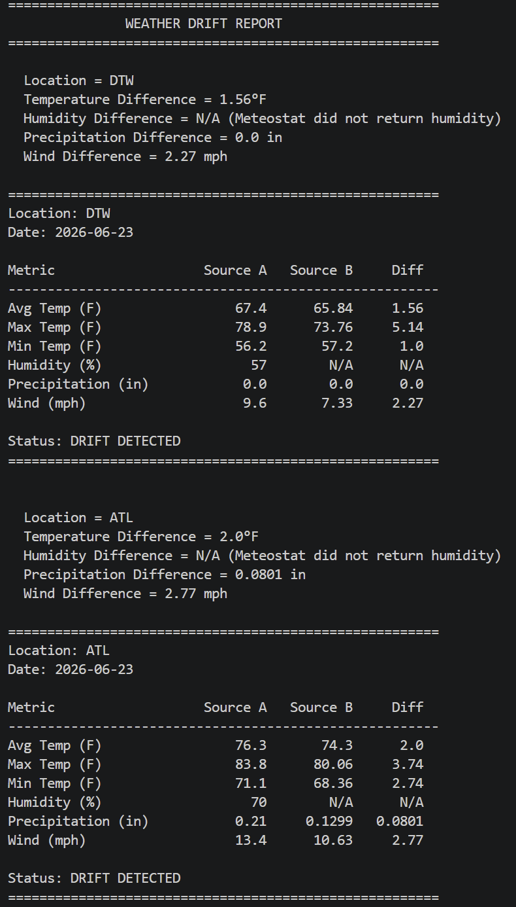

# Weather Drift Report

A configuration-driven Python application that retrieves weather data from two different wehater providers for the same locations, normalizes the responses, compares them, and generates a drift report highlighting differences between sources.

# 1. Setup Instructions

## Prerequisites:
- Python 3.8 or higher
- A free WeatherAPI.com account and API key
- A free RapidAPI account subscribed to the Meteostat free plan

### Step 1 - Clone the Repository
`git clone https://github.com/Rebeccaaby/api_integration_drift_report.git` \
`cd api_integration_drift_report`

### Step 2 — Create a Virtual Environment
`python -m venv venv`

#### Windows
- `venv\Scripts\activate`

#### Mac/Linux
- `source venv/bin/activate`

### Step 3 - Install Dependencies
- `pip install -r requirements.txt`

### Step 4 — Create Your Secrets File

The file `src/config/secrets.yaml` is not included in this repository for not including api keys.
Create it manually:
- In VS Code, navigate to src/config/ and create a new file called secrets.yaml. A template is provided in secrets.yaml.example. Add your keys in this exact format below.
- api_keys: \
    &emsp;weatherapi: "YOUR_WEATHERAPI_KEY_HERE"\
    &emsp;meteostat: "YOUR_METEOSTAT_RAPIDAPI_KEY_HERE"

#### Where to get your keys:

WeatherAPI: sign up at weatherapi.com -> Dashboard -> copy API Key
Meteostat: sign up at rapidapi.com -> subscribe to free plan -> copy x-rapidapi-key

### Step 5 — Add a New Location (Optional)

- Open src/config/settings.yaml and add a new entry under locations. No code changes are required

# 2. How to Run

Make sure your virtual environment is active(Step 2) and you are in the project root folder where main.py lives, then run:
- `python main.py`

### Output
After a successful run there is a console report printed to the terminal and two files saved automatically under:
- reports/ \
  &emsp;drift_report.json \
  &emsp;drift_report.csv

- A sample of real output is already included in the reports/ folder so results can be reviewed without running the application or obtaining API keys.

### Expected Console Output

# 3. Design Decisions

1. Secrets Separation:
API keys are stored in secrets.yaml which is excluded from version control via .gitignore. Application settings such as locations and weather provider names stored in settings.yaml which is safe to commit. This shows how secrets management is done where credentials are never stored alongside code. A secrets.yaml.example template is committed to show exactly what format is followed.

2. Normalized Data Model
Both providers return data in different formats - WeatherAPI uses imperial units already, Meteostat uses metric. Rather than comparing just the raw API responses, both are normalized into a common WeatherInfo dataclass before any comparison happens. This means the comparison engine has no knowledge of which API produced the data, it only works with the normalized shape.

3. Abstract Base Class for Weather Providers
WeatherProvider uses Python's ABC (Abstract Base Class) to enforce that every provider must implement the get_weather(). If a developer adds a new provider and forgets this method, Python raises a TypeError immediately at instantiation rather than a silent failure during a live pipeline run.

4. Provider Factory Pattern
The goal of provider_factory.py is to maintain a list dictionary mapping of config names to weather provider classes. Adding a third provider requires only creating the provider class and adding one line to the registry. Nothing else in the codebase changes in the main runner, in the config, or the reporter files.

5. Configuration-Driven Design
Locations and provider sources are defined entirely in settings.yaml. Adding a new airport or location or enabling a new provider requires only a config change - no Python code is touched anywhere.

6. Drift Thresholds
Rather than flagging every difference as drift, the comparator uses per-metric thresholds. Small differences between weather data are expected measurement variance. The current thresholds are:

> Metric         &emsp;&emsp;&emsp;&emsp;&emsp;&emsp;&emsp;&emsp;&emsp;&emsp;&emsp;Threshold \
> Temperature (avg / min / max)  &emsp;&emsp;2.0 °F \
> Humidity                       &emsp;&emsp;&emsp;&emsp;&emsp;&emsp;&emsp;&emsp;&emsp;&emsp;&emsp;5.0 % \
> Precipitation   &emsp;&emsp;&emsp;&emsp;&emsp;&emsp;&emsp;&emsp;&emsp;&emsp;0.1 in \
> Wind Speed       &emsp;&emsp;&emsp;&emsp;&emsp;&emsp;&emsp;&emsp;&emsp;&emsp;2.0 mph 

7. Report Formats
The console report is split into two parts per location. Part 1 shows a plain-language location summary matching the assignment specification. Part 2 shows the full metric table with source values side by side. Both parts come from the same LocationDriftReport object with no extra API calls needed.

8. CSV Column Design File
The CSV includes both a drift_detected column per row and a location_status column. These answer different questions - drift_detected identifies which specific metric caused the problem, while location_status gives an a quick status for the whole location. A reviewer can filter location_status = DRIFT DETECTED to find problem locations, then look at drift_detected = True rows to find the exact cause.

# 4. Assumptions

1. Date: The application always runs against yesterday's date, calculated dynamically at runtime using date.today() - timedelta(days=1). Today's data is often incomplete or unavailable from weather providers until the day has fully ended.

2. Units: All normalized output is in imperial units (°F, mph, inches). Meteostat data is converted from metric at the provider level before entering the shared model using standard conversion formulas.

3. Two sources: The comparison engine compares exactly two providers — sources[0] and sources[1] from the config N-way comparison across three or more sources is listed under Future Improvements.

4. Humidity availability: Meteostat's free tier does not return humidity for all locations. When humidity is unavailable from one source, the difference is omitted from the location summary and shown as N/A in the drift table. This is expected behavior, not a bug, and is noted explicitly in the console output.

5. Airport/Location coordinates: Latitude and longitude values represent the airport's approximate center point. Both APIs return data from the nearest available weather station to those coordinates, which may not be at the exact airport location. This accounts for some natural variance between sources that is not necessarily drift.

6. Graceful failure: If one weather api fails for a location (network error, rate limit, bad key), the pipeline logs the error, skips that location's comparison, and continues processing remaining locations rather than crashing entirely.

# 5. Future Improvements

1. N-way provider comparison: extend the engine beyond two sources to allow other providers for drift detection, where two sources agree and one is the outlier flagged as the problem source.

2. Configurable thresholds: move drift thresholds from hardcoded class attributes into settings.yaml so they can be tuned per metric without touching code.

3. Parallel API calls: use concurrent.futures.ThreadPoolExecutor to fetch all locations and sources simultaneously, reducing total runtime significantly for large location lists.

4. Retry logic: wrap API calls with exponential backoff to handle transient network failures or rate limit responses without requiring a full re-run.

5. Additional providers: OpenWeatherMap or Open-Meteo (fully free, no key required) could be added as third sources with minimal code changes due to the factory pattern already in place.

6. Historical trending: store drift reports over time in a lightweight database and surface patterns, such as one provider consistently reading higher than another for a specific location or season.

7. Alerting: send an automated email or Slack notification when drift is detected above a critical threshold, rather than only writing to a file.

8. Unit toggle: add a units: imperial/metric option to settings.yaml so the normalized model can output in either system depending on the user's preference.